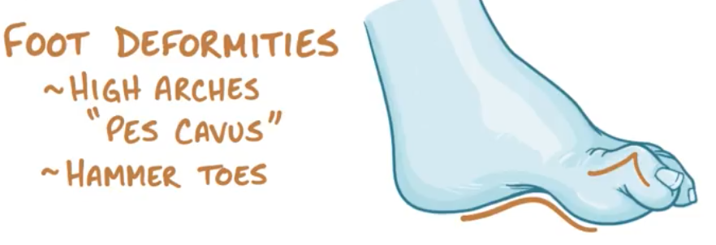

# Charcot-Marie-Tooth disease

Hereditary motor sensory neuropathies (HMSN), 腓骨肌萎缩症

==**对称性**==、缓慢进行性的**四肢周围神经髓鞘脱失和轴索变性**，造成肢体**==远端==**肌肉的**萎缩**和无力。

★CMT 患者临床表现的严重程度差异较大，**可仅有弓形足**，甚至**无任何临床症状**，仅在偶然的神经电生理检查中发现异常。而有些患者则**出现严重的肌肉无力和萎缩**。

## 分类: Types I-VII; Type X (X-linked)

- **CMT1**：多为常染色显性遗传，Demyelinating form 脱髓鞘型 => ↓NCV(Nerve conduction velocity), **PMP 22**突变, 70%

- **CMT2**：多为常染色显性遗传，Axonal form 轴索变性型 => NCV 正常或接近正常 20%
- CMT3：婴儿期起病，称为 Dejerine-Sottas disease (**severe** sensorimotor neuropathy that frequently **extends to the proximal muscles**, and is associated with skeletal abnormalities such as **scoliosis**)

- CMT4：常染色隐性遗传，称为Refsum disease
- **CMTX：**X连锁，**GJB1** 突变，20%

> CMT 的**任何一型**（包括脱髓鞘型）**均存在轴索变性**，且轴索丢失的程度是影响 神经损伤的主要因素 。 

### CMT1

**Cause:** mutations in ==*PMP22* (CMT1A, peripheral myelin protein-22)==, ==*MPZ*(CMT1B, myelin protein zero)== genes (encode for myelin sheath proteins)

常染色显性遗传，脱髓鞘型 => ↓NCV(Nerve conduction velocity)

★**自主神经**和**脑神经**一般不受累。

**Diagnostics:** 

1. Nerve biopsy: repeated demyelinationand **==remyelination==** evident in large nerve fibers (**==onion peel appearance==**)

   > CMT 1 型可以**触及粗大的周围神经**，尤其是**耳大神经**和**尺神经**

2. Nerve conduction studies: ↓ impulse conduction velocity

**Clinical Features:** 

1. **小腿开始的肌萎缩**

   - [Atrophy](https://www.amboss.com/us/knowledge/Cellular_changes_and_adaptive_responses#Za78e93e8d8af6655bfa6f64569ad19e2) of the calf muscles -> [Foot drop](https://www.amboss.com/us/knowledge/Peripheral_nerve_injuries#Zbb2234eb409b82043629ee23dffb366e) -> Steppage gait 跨域步态
   - 足部肌肉萎缩 -> **==Pes cavus deformity==**，**==[Hammer toe](https://www.amboss.com/us/knowledge/Toe_deformities#Z1210a6f3cdf5cf727680095fc2325187)==**

   

   - 累及**小腿全部肌群**和**大腿的下 1/3** 时，整个下肢呈倒立的香槟酒瓶状 -> **鹤腿**(**“stork legs”**)

   - After **several years**, Intrinsic hand muscule may become involved. 波及手肌和前臂肌 => 系纽扣、开锁等动作困难。

     > CMT 肌肉萎缩很少超过肘部和大腿的中 1/3 。

2. **感觉障碍：**不突出，occurs late，深、浅感觉减退多呈手套-袜套样改变，★如果没有感觉损害的体征，肌电图也无感觉障碍的证据则应考虑其他诊断的可能，如**远端型肌萎缩症**。

3. **腱反射减低或消失**

### CMT2

**Cause:** mutations in ==*MFN2*== gene (encodes for **mitofusin-2 protein** in neuronal mitochondria) → neuronal death

常染色显性遗传，轴索变性型 => NCV 正常或接近正常

**Axonal disease** (no [demyelination](https://www.amboss.com/us/knowledge/Nerve_tissue,_synapses,_and_neurotransmitters#Z3989c89276a0b832011799ccd3e98f1e) and remyelination) → no nerve [hypertrophy](https://www.amboss.com/us/knowledge/Cellular_changes_and_adaptive_responses#Z2565f5179622b57d8e166369a90801a0)), **no onion peel appearance**

★Sparing sensory neurons, resembling **progressive spinal muscular atrophy**, 远端型**脊肌萎缩**症

## 诊断

**临床表现**：儿童或青春期起病 + 缓慢进展的对称性双下肢无力 + ＂鹤腿＂、足下垂、弓形足 + 感觉障碍 + 腱反射反射减弱

**电生理：**运动神经传导速度减慢

**神经活检：**有脱髓鞘和（或）轴索变性

**基因检测**

★**家族史：**无明确家族史的患者父母进行神经科检查非常重要

## 鉴别

- 远端型**肌营养不良**：肌电图呈**肌源性改变**，运动神经传导速度正常；四肢远端逐渐向上发展的肌无力、肌萎缩。
- 远端型**脊肌萎缩**症：肌萎缩分布和病程与 CMT 2 型相似，**前角细胞损害**(肌电图上可见广泛的纤颤、束颤和巨大动作电位)，**脊旁肌肉**和**颊舌肌或面肌**广泛的失神经支配提示脊肌萎缩症 。
- 遗传性**共济失调**伴**肌萎缩**症（又称 Roussy-Levy 综合征） ：缓慢进展的病程，有腓骨肌萎缩、弓形足、反射消失、神经传导速度减慢，神经活检有脱髓鞘和洋葱头结构，这些类似 **CMT 1 型**，但是 ==**有振动觉和位置觉的缺失**，**感觉性共济失调**和**姿势性震颤** 。==

