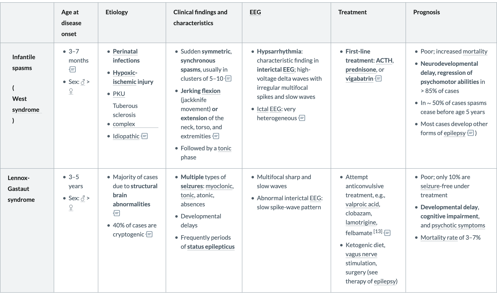

# Epilepsy syndromes

## Idiopathic generalized epilepsy syndromes

### Juvenile myoclonic epilepsy

- One of the most common epilepsy, 8 - 18 岁

- Usually in the ==**early morning, soon after awakening**==.

- **Traid**(单独或同时出现): 

  ①**Myoclonic seizure**(==Bilateral symmetrical== **[myoclonic](https://next.amboss.com/us/article/o500Og#Z01d6df8be10035f023994d8f101e42fe) jerks**, without impaired consciousness)

  ②**Generalized [tonic-clonic](https://next.amboss.com/us/article/RR0l5f#Z39768e930bb5fa124e30a7cbab2dc9b2) [seizures](https://next.amboss.com/us/article/RR0l5f#Z34c7e6b1cab99047c956783229d49b59)** -> happens**==in the context of sleep deprivation or alcohol ingestion==**

  ③[Absence seizures](https://next.amboss.com/us/article/jR0_5f#Z84445f9bf9203c148ad6809c64e170f2) with impaired consciousness `Least common`

- **Triggers**: sleep deprivation, alcohol consumption, **flickering lights**

- **EEG:** Irregular 3–5 Hz polyspikes and waves with **frontocentral predominance**

- **治疗：**valproic acid

- Responds well to [antiseizure drug](https://next.amboss.com/us/article/-N0Ddg#Zcd438fb2824eb980a6d8940c193890ba),  ==**Life-long treatment usually required (high risk of recurrence)**==

### Juvenile absence epilepsy

- 9 - 13 青春期，男女相同
- **失神发作**：少于 **[childhood absence epilepsy](https://next.amboss.com/us/article/jR0_5f#Z36ac3e42b8ed38dce15bc0ad7c5e9a1c)**
- ==**80% 有 Tonic-clonic seizures**== -> valproic acid 为1线**治疗**
- 预后较好，60%治疗后无发作，可转化为**Juvenile myoclonic epilepsy**

### Childhood absence epilepsy

- 6-7岁，女孩多见，遗传

- **失神发作**

  ①lasting **5–10 seconds**，发作频繁，up to 100x/d 

  ②无肌阵挛

  ③**Amnestic** during seizures

  ④**Lip smacking, eye fluttering or head nodding are common**

- **非典型失神发作**：**more gradual** onset and ending, **duration of > 30 seconds**.

- **Triggers:** ==hyperventilation==, lights

- 治疗：**Ethosuximide**, 预后好，80%药物治疗后无发作

  > ★*九版书为 sodium valproate*
  >
  > Both [ethosuximide](https://next.amboss.com/us/article/-N0Ddg#Z92315e6aac25479596341610d7d4e742) and sodium [valproate](https://next.amboss.com/us/article/-N0Ddg#Zfe47f4f5fb7f8de32f7919dc8909896e) have a similar efficacy in preventing [absence seizures](https://next.amboss.com/us/article/jR0_5f#Z84445f9bf9203c148ad6809c64e170f2) in [childhood absence epilepsy](https://next.amboss.com/us/article/jR0_5f#Z36ac3e42b8ed38dce15bc0ad7c5e9a1c). However, the risk of attentional dysfunction is higher with sodium [valproate](https://next.amboss.com/us/article/-N0Ddg#Zfe47f4f5fb7f8de32f7919dc8909896e) than [ethosuximide](https://next.amboss.com/us/article/-N0Ddg#Z92315e6aac25479596341610d7d4e742).

## Symptomatic or cryptogenic generalized epilepsy syndromes

> These syndromes ==do not respond well to [antiseizure drug](https://next.amboss.com/us/article/-N0Ddg#Zcd438fb2824eb980a6d8940c193890ba) therapy== and are commonly associated with **developmental delays**, as well as **motor** and **cognitive impairments**.

### Infantile spasms(**[West syndrome](https://next.amboss.com/us/article/jR0_5f#Z7e909d273a484ecf5eee446f36de8794)**)

- 3–7 months(**1年内发病**)