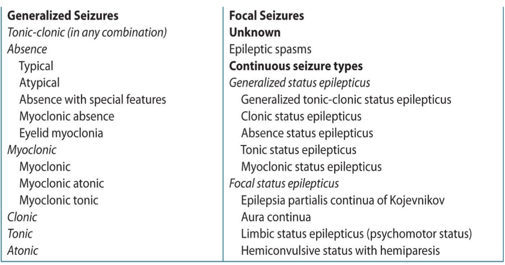
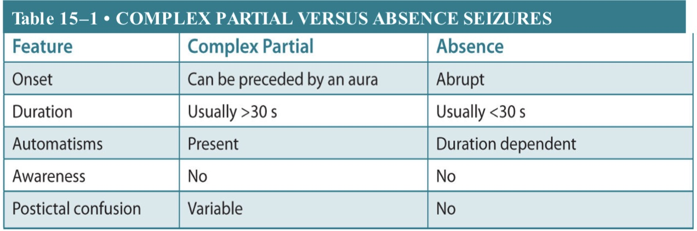

# Focal seizure VS Absence seizure

Seizure: 短暂 自限性 高度同步化的皮层神经元放电导致的大脑功能障碍

epilepsy: 2次间隔24h以上的无诱因的发作

Approximately **one-third of women with epilepsy** have seizures **clustered around menstrual cycles**. This is called **<u>catamenial seizure exacerbation</u>** or <u>**catamenial epilepsy**</u>.

## Simple Partial Seizure

> No alteration of consciousness

### Features:(与发作的部位有关)

- Simple motor movement
  1. Jacksonian seizure
  2. Adversive seizure
- Unilateral sensory aberration
- Complex emotional episode
- Visual/auditory/olfactory hallucination 

### <u>Aura = Simple partial seizures</u>:(related to the site of cortical onset)

>  *Most common aura:* **abdominal discomfort**

- Temporal lobe seizure(limbic, or psychomotor seizures)

  **Abdominal discomfort** => 影响了自主神经系统(岛叶, 颞叶内侧), [fear, feeling of unreality, detachment from the environment, **déjà vu**`即视感`, or jamais vu`陌生感`]=>影响了边缘系统, auditory/olfactory hallucination 

- Parietal lobe seizure ->影响了中央后回

  Electrical sensation, tingling, numbness

- Occipital lobe seizure

  Visual hallucination: perception of colored lines, spots, shapes or even a loss of vision.

### Frontal lobe epilepsy

*Frontal lobe seizures often begin with vigorous motor automatisms or stereotyped clonic or tonic activity*

- **Motor symptoms**: 

  - Muscle tension, Vocalization

  - Gaze deviation, Head directed towards the unaffected side 

    > This is caused by rhythmic hyperactivity of [neurons](https://www.amboss.com/us/knowledge/Nerve_tissue,_synapses,_and_neurotransmitters#Zeb508d67af399f2b2da18e8b2cc5eed8) in the motor cortex. It must not be confused with gaze deviation caused by [ischemic stroke](https://www.amboss.com/us/knowledge/Ischemic_stroke#Z3f7f430199f473aaabb99166a1434619). In [ischemic strokes](https://www.amboss.com/us/knowledge/Ischemic_stroke#Z3f7f430199f473aaabb99166a1434619), neuronal death occurs and activity is therefore decreased – the patient looks towards the affected side.

- Impairment of [speech](https://www.amboss.com/us/knowledge/Mental_status_examination#Zd423a68450327021f26303182c94ebe1)

- ==Autonomic symptoms (enuresis, salivation)==

- Jacksonian march, [Todd's paralysis](https://www.amboss.com/us/knowledge/Seizure_disorders#Z36aecd724f7ee52e76856d09c4cba2eb)

- Usually a series of short [seizures](https://www.amboss.com/us/knowledge/Seizure_disorders#Z34c7e6b1cab99047c956783229d49b59) (≤ 30 s) occurring during sleep (which often wake the patient)

- **No aura, No postictal period of confusion!!!**

### Parietal lobe epilepsy

- **Sensory symptoms** (e.g., paresthesia, pains) 
- Dyslexia
- **Sensory aphasia**
- Possible [Jacksonian march](https://www.amboss.com/us/knowledge/Focal_seizures_and_syndromes#Zcade834e4313fc0a52b4bb71ab813130)
- Transition to temporal or [frontal lobe seizures](https://www.amboss.com/us/knowledge/Focal_seizures_and_syndromes#Z664086f2cb8b0841aafe912f2bbdac4d) (featuring the respective symptoms) may occur.

### Occipital lobe epilepsy

- **[Visual hallucinations](https://www.amboss.com/us/knowledge/Mental_status_examination#Zfef30dc904979d70213ed4c220efbd77)**
- Gaze deviation
- Cortical blindness
- Transition to temporal or [frontal lobe seizures](https://www.amboss.com/us/knowledge/Focal_seizures_and_syndromes#Z664086f2cb8b0841aafe912f2bbdac4d) (featuring the respective symptoms) is possible.

### Epilepsia partialis continua

**Etiology:** unspecific; current or past damage to the cortex (e.g., scar tissue, encephalitis, tumors)

**Clinical features:**

- Clonic muscle activity of a particular region of the body (**partialis**), e.g., mouth, finger
- Symptoms persist for several days (**continua**).
- Might be considered a focal [status epilepticus](https://www.amboss.com/us/knowledge/Seizure_disorders#Z8f18b31218dc173e47238020dc821891)

**Treatment**: treat the underlying condition

## Complex Partial Seizure

> <u>**CPSs is the most common type of seizure  in  adults**</u>
>
> Individuals older than 65 years have a higher incidence of seizures and etiologies more likely due to ==cerebrovascular accident (CVA), dementia, neurodegenerative disorders, tumors, trauma==

**==3/4 emanates from the temporal lobe== but can arise from any cortical region** 

**Hippocampal sclerosis**: found in approx. 70% of patients suffering from **temporal lobe epilepsy** that is <u>resistant to pharmacotherapy</u>

**SPECT:** ①hypoperfusion of bilateral frontal and parietal association cortex②hyperfusion of the mediodorsal thalamus and rostral brainstem

**Symptoms:**

- **Begin with a brief aura**(*Most common aura:* **abdominal discomfort**)

- **impaired level of consciousness => 影响了边缘系统**（在颞叶内侧海马附近）=> ==motionless stare== + **==automatisms==** (appear to be awake but do not respond normally to their environment)
- Autonomic symptoms
  - [Tachycardia](https://www.amboss.com/us/knowledge/Cardiovascular_examination#Z3ae4e1e5581c7405590e65b57fa82021)
  - ==Urge to void the [bladder](https://www.amboss.com/us/knowledge/Overview_of_the_urinary_tract#Zb39fa0c160d5f2d2d45d0f06da0f4fcf)==
  - [Mydriasis](https://www.amboss.com/us/knowledge/Physiology_and_abnormalities_of_the_pupil#Z7c2c58011b8475657d8daefa023acf40)
  - Sweating, salivating
- become hostile or aggressive of is physically restrained
- Transiently confused and disoriented after seizure, ==lasts minutes to hours==
- **Lasts minutes(>30s)** ↔︎ absence seizure lasts seconds(<30s)

**Automatisms:** repetitive, stereotyped, unconscious motor or verbal behaviors

- Verbal automatisms: moaning -> more complex, comprehensible stereotyped speech

- Motor automatisms

  1. Simple Motor automatisms

     ① **Oral automatisms**: lip smacking, chewing, swallowing **-> most common**

     ② Manual automatisms: picking, fumbling, patting `单侧的提示是对侧大脑半球的癫痫发作`

  2. Complex motor automatisms: more elaborate, coordinated movements **involving bilateral extremities**, e.g. <u>cycling movements of the legs</u> and <u>stereotyped swimming movements</u>

     ？==frontal lobe seizures== -> 较为复杂的自动症，因为有中央前回部位

     *Bizare automatisms*: can occur with ==frontal lobe seizures==.

     ①alternating limb movements②right-to-left head rolling③sexual automatisms 

> Automatisms can also occur during **nonepileptic states of confusion** (eg, metabolic encephalopathy), **after a seizure**, and **during absence seizures**

## 猜想简单\复杂发作与位置的发作部位的关系

意识的改变原因是影响了边缘系统（在颞叶内侧海马附近）、自主神经系统区域、颞叶。

？复杂局灶性发作通常在颞叶，但可在其他任何部位，因为其他部位的发作可播散至**颞叶(意识改变)**及**额叶**(自动症?)

？额叶癫痫通常为局灶性发作，局灶性发作也可发生在其他任何部位

## Absence  Seizure(petit mal)

失身发作基本不会在成人开始发作，通常在儿童时期4 -14出现，70%在18岁就停止了。

**Symptoms:**

- **<u>Motionless staring and cessation of ongoing activity</u>**

- **No aura**, Begin and end abruptly, **Not associated with postictal confusion**

- Unlike CPSs, ==Rarely last more than 15s.==

- **Typically no automatisms** 

  > With longer attacks, ==mild myoclonic== of the **eyelid** or **facial muscles**, ==loss of muscle tone==, ==automatisms== can accompany.

- **Precipitated by hyperventilation**
- **Children with classic absence epilepsy have ==normal development and intelligence==**

**EEG:** symmetrical generalized 3Hz spike wave

**Atypical Absence Seizure:**

- beginning and end are not distinc
- tonic and autonomic components occur
- 通常在有**认知障碍癫痫患儿**中发生 or **in patients with epileptic encephalopathy**(e.g. Lennox-Gastaut sydrome)

## Management:

### Diagnosis:

CT/MRI, EEG/Sleep deprived EEG/prolonged video EEG, lumbar puncture

**CPS:** Coronal T2-weighted MRI of the brain showing right mesial temporal sclerosis.

### Treatment:

- Therapy with one agent is generally preferred

- Ethosuximide is an anticonvulsant that is only indicated for absence seizures

- If a diagnosis of absence seizures is made, the likelihood of other ==coexistent seizure types, such as myoclonic or tonic-clonic, should be considered==, as ethosuximide would not be indicated for such case presentation. 

- Valproic acid is also effective against absence, myoclonic, and tonic–clonic (as well as partial) seizures.

- **Valproate** and **phenobarbital** are more likely to cause **neural tube defects** in a dose-related fashion than other anticonvulsants.

- **Surgery**

  temporal lobectomy

  extratemporal resections

  corpus callosotomy

  placement of a vagus nerve stimulator

  hemispherectomy

  multiple subpial transections

