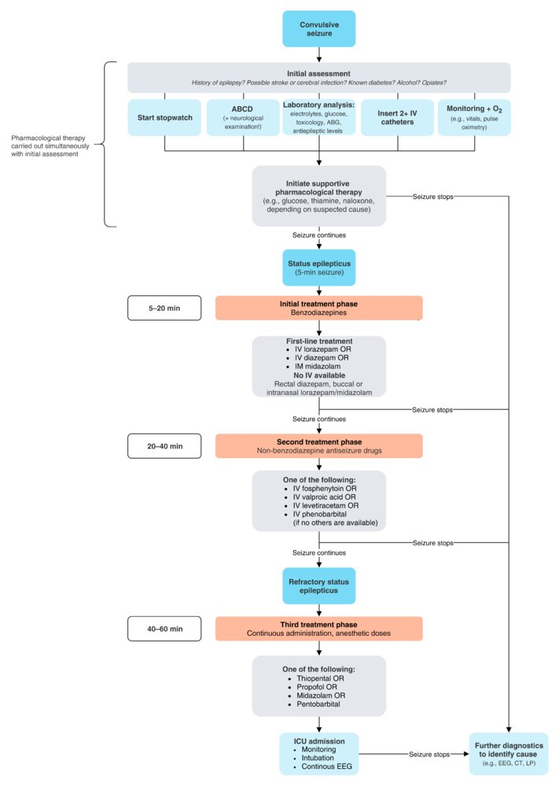

# Management of status eplilepticus

**Status epilepticus**：①a seizure continuing for 5 to 30 minutes ②seizures recurring so frequently that full consciousness is not restored between successive episodes

> ==**Status epilepticus is a medical emergency**== because it can lead to **permanent brain damage** from hyperpyrexia, circulatory collapse, or excitotoxic neuronal damage if untreated.

## Etiology:

1. Withdrawal from [antiepileptic drugs](https://next.amboss.com/us/article/-N0Ddg#Zcd438fb2824eb980a6d8940c193890ba), drug toxicity
2. Metabolic disturbances (e.g., [hyponatremia](https://next.amboss.com/us/article/rg0f92#Z482f3cc1cfc32af07678821b7e06fb08))
3. Structural brain lesions/injury (e.g., tumors, trauma, [stroke](https://next.amboss.com/us/article/UR0bmf#Zdd37bc451d2e210ed3e03be192079b6c))
4. [CNS](https://next.amboss.com/us/article/lp0vpS#Z0111aade770ed6f7d136b455de1d6c1f) infections
5. Sleep deprivation

## Management

- If acute brain injury (e.g., [intracerebral hemorrhage](https://next.amboss.com/us/article/fR0kmf#Z8ddc2bfdb3ada3f99bfb02ec06d1be4d)) is suspected → obtain a [cranial](https://next.amboss.com/us/article/xo0EVS#Z2eb72d2494721debd42b3e4d3e6b9bad) CT
- If [CNS](https://next.amboss.com/us/article/lp0vpS#Z0111aade770ed6f7d136b455de1d6c1f) infection is suspected → conduct a [lumbar puncture](https://next.amboss.com/us/article/-l0DzT#Z1e2677482998439ed77e51580e7a8efa)

### Pharmacotherapy

Initial treatment phase:(5-20min)

1. First line: **==lorazepam==** `fast and long acting`

   > 九版教材首选**地西泮**

2. If the patient does not respond **within 1 minute** → administer **additional [lorazepam](https://next.amboss.com/us/article/CN0qWg#Zfd8ded48aa52271ae4a89cf0a0244391)**

3. If the patient does not respond **within another 10–20 minutes**

Second treatment phase:(20-40min)

4. saturation with **[fosphenytoin](https://next.amboss.com/us/article/-N0Ddg#Z7d8162be90e283bd44e478b7cdce430b)**
5. If the patient does not respond **within another 20 minutes**

Third treatment phase:(40-60min) 难治性癫痫：发作1h以上，插管，麻醉

6. **continuous administration of anesthetics** with **[intubation](https://next.amboss.com/us/article/hl0c9T#Z35189a36e3ecbd4acce6b05b19ab088d)** and **ICU monitoring**; e.g., [thiopental](https://next.amboss.com/us/article/vN0A1g#Z78fb39769d480163ce52c6d60b6e0b1a), [propofol](https://next.amboss.com/us/article/vN0A1g#Z4109b56fc8a5b7cea5555b5edb8bfdc0), or [midazolam](https://next.amboss.com/us/article/CN0qWg#Z28fd126004f419ce655e8a1691ad1ff0)

停止后预防发作：[fosphenytoin](https://next.amboss.com/us/article/-N0Ddg#Z7d8162be90e283bd44e478b7cdce430b) or [valproate](https://next.amboss.com/us/article/-N0Ddg#Zfe47f4f5fb7f8de32f7919dc8909896e)

> 九版教材为**==苯巴比妥==**预防

