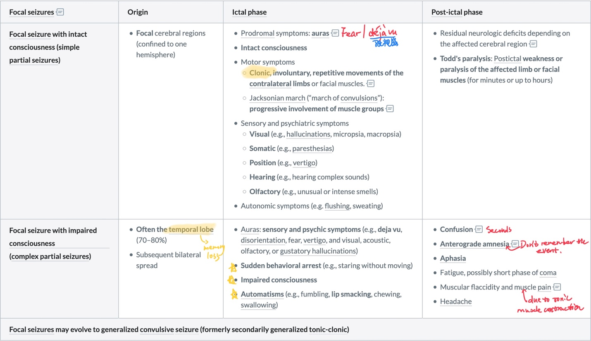
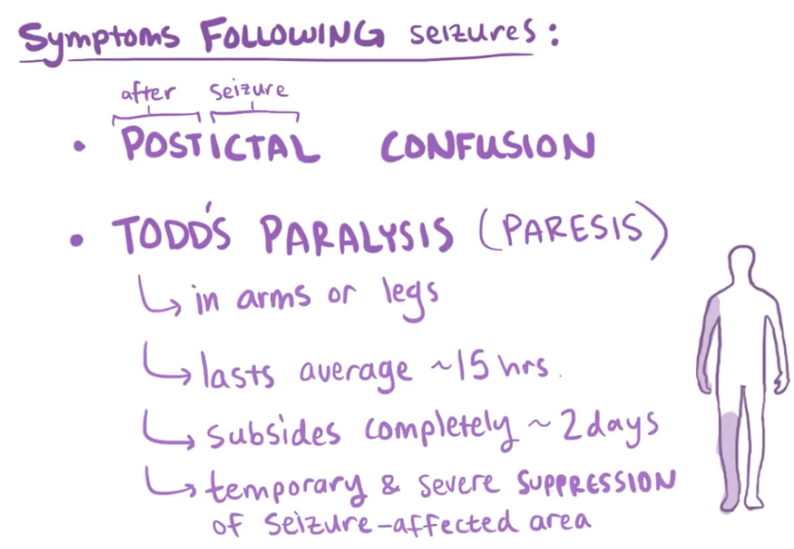
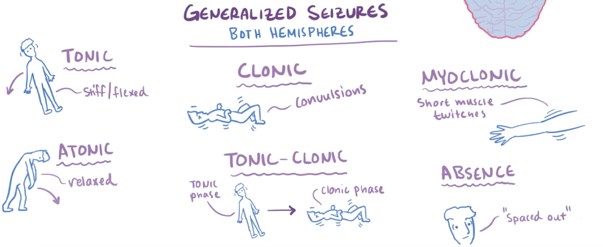
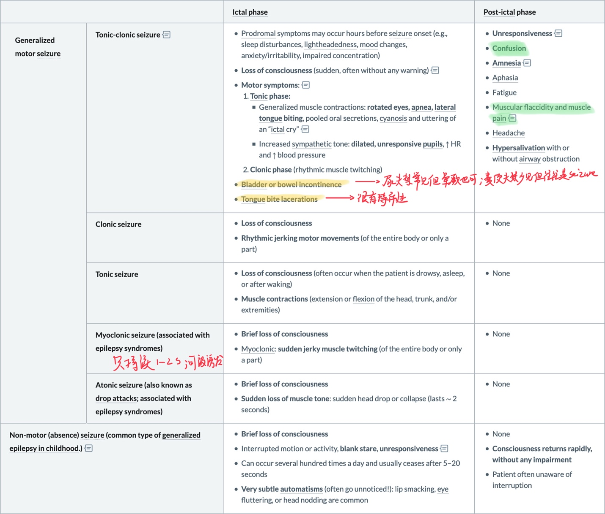
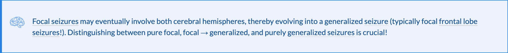
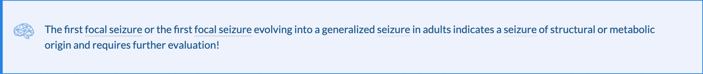
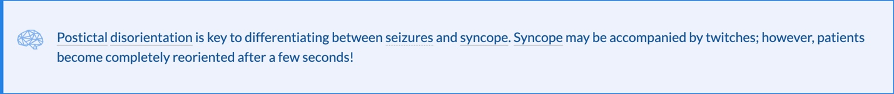

# Seizure overview

[Generalized seizures](https://next.amboss.com/us/questions/udthp7cfY/23/article/RR0l5f#Z78ed1843244ca259945a92840fc6b3ca) arise from discharges in both hemispheres, whereas [focal seizures](https://next.amboss.com/us/questions/udthp7cfY/23/article/iR0J5f#Z5bad57bf6fb0e7d13b19dbe3b042b15f) begin with discharges in one hemisphere.

Focal seizure: 1. Without 2. With awareness

Focal onset bilateral tonic-clonic seizure: focal -> generalized seizures

Generalized seizures:

tonic-clonic seizure ——— most common

 

 

 

**Differential diagnosis:**

**Psychological disorders**:

**1.**       *Pseudoseizures:* psychiatric origin, **closed eyes, no or only slight increase in CK and prolactin, duration often considerably longer (up to hours).** 

*2.*       *Panic attacks*

*3.*       *Psychogenic hyperventilation*

**Syncope**: gradual loss of consciousness, last for a maximum of 15 seconds and rarely involve [tongue](https://www.amboss.com/us/knowledge/Oral_cavity#Z2ede91c43f398344fca83c88a7d75d15) biting or [headaches](https://www.amboss.com/us/knowledge/Headache#Z67ba0252fff6842349617790ed19ae54), postictal [disorientation](https://www.amboss.com/us/knowledge/Mental_status_examination#Z16cc45c73218cf36f04af8b09c7b5321) only lasts for a maximum of a few minutes. 

1. Vasovagal syncope: No CK elevation in the serum after the event 

2. Stokes-Adams attack: Short sinus node arrest; **no prodrome** → sudden loss of consciousness and [amnesia](https://www.amboss.com/us/knowledge/Mental_status_examination#Zaa08c1d5773f47cc23c60589cfd6f974) → equally sudden awakening 

3. Carotid sinus syndrome: Pressure on carotid sinus leads to cardiac arrest. 

4. Cardiac failure

5. Orthostatic hypotension

**Stroke**(including transient ischemic attack, Particularly of the **basilar artery**): However, strokes can also cause seizures

**Migraine**: Particularly **basilar migraine**

 ## Treatment

- lamotrigine (first-line treatment in focal seizures)

- valproate (first-line treatment in generalized seizures)

- ethosuximide (first-line treatment in typical absence seizures).

 

 

 