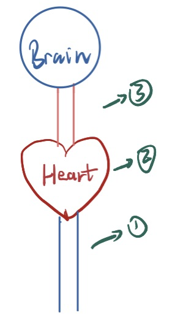
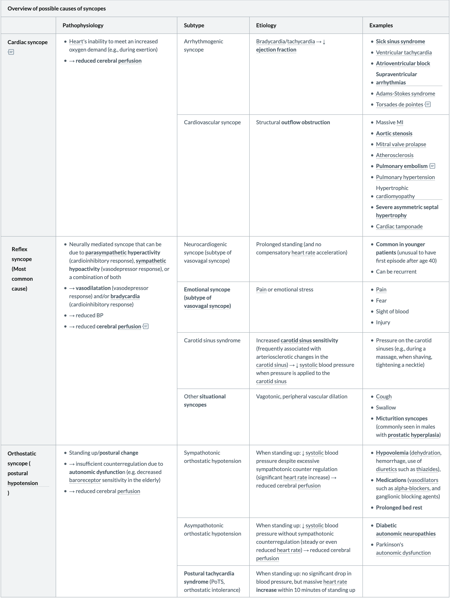
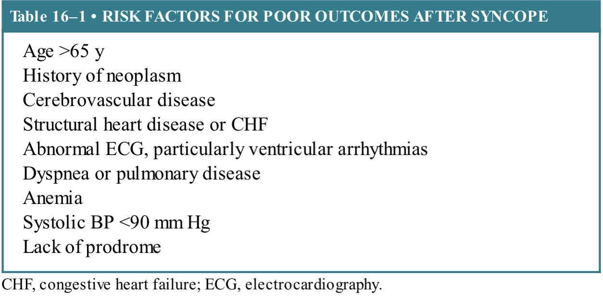
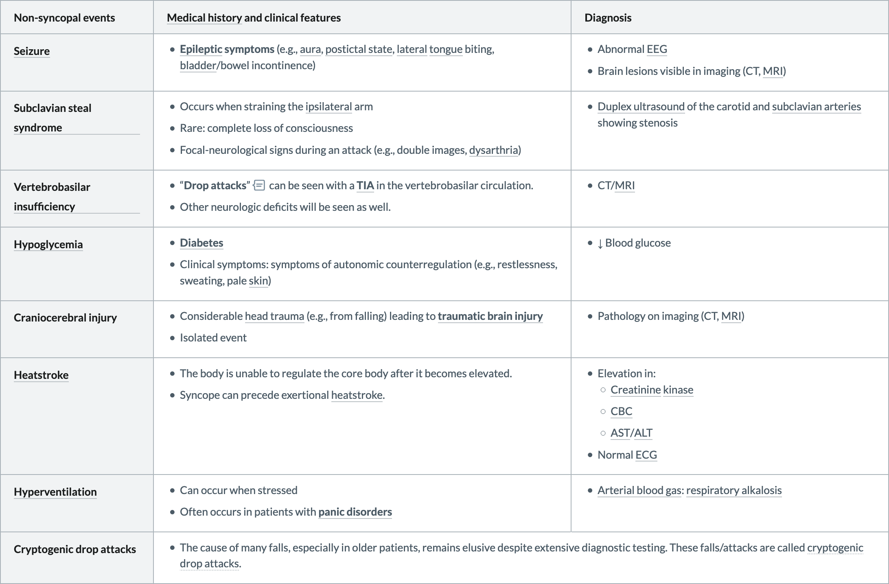

# Syncope

## Clinical features

- **Prodrome:** **presyncope**
  1. **Vasovagal**: impairment of senses; **nausea, pallor , warmth, diaphoresis**, lightheadedness, and hyperventilation
  2. **Orthostatic:** lightheadedness, nausea, and dizziness
  3. **Cardiac**: no prodrome; often sudden fall
- **Rapid onset loss of consciousness**
  1. Accompanied by complete **loss of muscle tone**
  2. Last seconds to minutes followed by spontaneous recovery
  3. **Convulsive syncope**: common form in which loss of consciousness is accompanied by myoclonic movements

## Etiology

### Cardiogenic syncope

**Cardiogenic syncope** is caused by **impaired cardiac output** (*cardiac output [CO] = stroke volume [SV] × heart rate [HR]*), which leads to cerebral hypoperfusion.

1. Heart Rate/arrhythmia

   - **Bradycardia**: HR<35, Sick sinus syndrome, Conduction abnormalities, Medications

   - **Tachycardia:** HR>150, <u>Atrial fibrillation</u>, Paroxysmal supraventricular tachycardia

     > The presence of **==palpitations==** is worrisome for arrhythmia-associated cardiogenic syncope.

2. Cardiac output

   

   - **Impaired venous return**: Cough, Valsalva

     > Also warrants consideration of <u>neurocardiogenic</u> or <u>vasovaga</u>l syncope

   - **Cardiac outflow obstruction**

     ①**Aortic stenosis**: most common

     ②Hypertrophic obstructive cardiomyopathy: less common, but should be considered in young patients

     ③**[Pulmonary embolism](https://www.amboss.com/us/knowledge/Pulmonary_embolism#Zfb01fcdeb51ff26f23e3b2e25e04e156)**:is a significant cause of first episode syncope in patients not on anticoagulation therapy.

     > ==Exertional syncope== may suggest cardiac outflow obstruction: 活动后HR↑ -> 心室充盈↓ -> 梗阻加重 ->射血减少

   - **Neurovascular abnormalities** (Lesion of arteries that supplies brain)

     ①Carotid occlusive/stenotic disease

     ②Vertebrobasilar insufficiency

### Vasovagal syncope (most common type)

1. **Neurocardiogenic syncope**
   - Prolonged standing(and no compensatory [heart rate](https://www.amboss.com/us/knowledge/Cardiac_physiology#Z5a1c62ca5426efb7b9ea9953c8aa17c7) acceleration): **Common in younger patients** (unusual to have first episode after age 40)
2. **Emotional syncope**
   - [Pain](https://www.amboss.com/us/knowledge/Pain_management#Zd673a3f7ee36023aab5a267899e984cc)
   - Fear
   - Sight of blood
   - Injury
3. **Carotid sinus syndrome**:Pressure on the carotid sinuses
4. Other **situational syncopes**: 
   - [Cough](https://www.amboss.com/us/knowledge/Cough#Z53178f74af701c6933574f4f111d6391)
   - Swallow
   - **Micturition syncopes** (commonly seen in males with **[prostatic](https://www.amboss.com/us/knowledge/Male_reproductive_organs#Z6193c696f64ae504f5c057459595b7f3) [hyperplasia](https://www.amboss.com/us/knowledge/Cellular_changes_and_adaptive_responses#Z7c2f7198db9b555525515960ad48bd59)**)

### Orthostatic syncope

> Defined by a drop in systolic blood pressure (**SBP**) of at least **20 mm Hg** or diastolic blood pressure (**DBP**) of at least **10 mm Hg**, with or without change in HR, ==within 3 minutes of change in position== from supine to sitting or sitting to standing

1. **Hypovolemia** or increased venous pooling (functional hypovolemia) `特别是老人`

   > ↓ [systolic](https://www.amboss.com/us/knowledge/Cardiac_physiology#Z9e1d73864076f821ef56815157f60808) blood pressure ==despite excessive sympathotonic counter regulation== (significant [heart rate](https://www.amboss.com/us/knowledge/Cardiac_physiology#Z5a1c62ca5426efb7b9ea9953c8aa17c7)  increase)

   Also **Prolonged bed rest**, **Medications** like alpha-blockers

2. **Autonomic dysfunction**:

   - Diabetic peripheral neuropathy
   - Acute inflammatory demyelinating polyneuropathy (AIDP): *has been associated with dysautonomia due to peripheral nerve involvement*
   - Multiple system atrophy: *orthostatic hypotension is one of the cardinal features, a neurodegenerative disease characterized by <u>parkinsonism</u> or <u>cerebellar dysfunction</u>, <u>dysautonomia</u>, and <u>pyramidal symptoms</u>*

## Evaluation

1. Cardiac evaluation: ECG, vital signs; EEG, neuroimaging if high suspicion for seizres

2. Comfirmed syncope -> stratified by risk

   - High risk: have serious events within 1 week -> admitted for inpatient workup

   

   - Low-risk patients ->  follow up on outpatient basis

     > Carotid ultrasound,  cardiac stress testing, implantable loop recorder

## Treatment

- **Vasovagal syncope**: Avoid triggers
- **Orthostatic hypotension**: 
  1. Volume resuscitation, compressive stockings, and avoidance of contributing medications (eg, betablockers). 
  2. If symptoms persist, pharmacologic treatment with **midodrine**(alpha-agnist) and/or **<u>fludrocortisone</u>**(mostly mineralocorticoid activity)
- **Cardiac syncope**: Treat underlying conditions

## Differential

**Seizures:** (详见 [First Seizure of the adult.md](First Seizure of the adult.md))

1. convulsive activity
2. ==lateral== tongue biting
3. bladder or bowel incontinence
4. postictal confusion.

